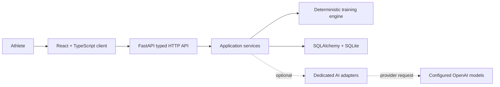
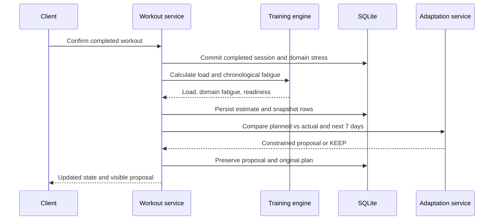

# Architecture

## System shape

Adaptive Training Coach is a single-athlete, local-first web application. One local FastAPI process owns data and calculations; one React client presents that state. SQLite is the default durable store, and external AI is optional.



The system remains useful when the dotted AI path is unavailable.

## Repository layout

```text
.
├── backend/
│   ├── alembic/                 schema migrations
│   ├── app/
│   │   ├── api.py               route definitions and dependencies
│   │   ├── schemas.py           Pydantic request/response contracts
│   │   ├── services/            application use cases and transactions
│   │   ├── training_engine/     pure deterministic calculations and rules
│   │   ├── ai/                  prompts, typed AI contracts, provider adapters
│   │   ├── models.py            relational ORM models
│   │   └── db.py                engine and session setup
│   ├── data/                    ignored local database/media/export directory
│   └── tests/
├── frontend/
│   └── src/
│       ├── api/                 typed backend client
│       ├── components/          reusable presentation components
│       ├── pages/               nine product pages
│       ├── api/hooks.ts         UI data-loading hook
│       └── types.ts             frontend domain views
├── docs/                        durable contracts
├── Makefile
└── .env.example
```

## Backend boundaries

### API layer

Routes parse Pydantic inputs and serialize JSON results. Most orchestration and all training calculations live in services or the training engine. The current `app/api.py` also contains a few small direct ORM reads/writes for goals, benchmarks, settings, and list endpoints; moving those remaining operations behind services is a contributor boundary, not a claim about this revision. Prompt/provider code remains in `app/ai/`.

### Service layer

Services own the single-user use cases, history preservation, idempotency decisions, and orchestration. A completed-workout request currently runs the following ordered post-save pipeline:



These steps use multiple service commits rather than one database transaction. This deliberately keeps a valid workout when optional AI fails, but an unexpected deterministic post-save error can leave the workout saved before all derived rows are written; retry/idempotency is therefore important. The workflow never erases the original planned session. AI analysis may enrich a deterministic-safe proposal, but provider failure cannot roll back a valid workout save.

### Deterministic training engine

The engine accepts typed domain values and returns typed results without HTTP, database, filesystem, or network access. Fatigue callers can pass an explicit evaluation time; service reads otherwise evaluate at the current UTC time. Stress settings, half-lives, and readiness thresholds can be overridden through the stored engine setting, while demand profiles and adaptation thresholds remain versioned code constants in V1. This makes fixed-clock scenario tests reproducible.

Pure modules are separated into session load, fatigue decay, readiness, mileage progression, adaptation, and configuration. Running/climbing state queries live in the service layer. The formulas and precedence rules live in [docs/training-engine.md](docs/training-engine.md).

### Persistence

Relational tables preserve common sessions and sport-specific detail. JSON stores flexible nested structures including splits/intervals, soreness areas, style tags, note lists, snapshots, and provider payloads. All tables have primary keys (or an owning-session key); timestamps are present on user-facing top-level records but not every detail/snapshot table. History-bearing plans use revision/event rows, gym sets use validity dates, and benchmark/estimate updates append rows.

`make dev` applies Alembic before startup, and Alembic is the portable schema-evolution mechanism. The FastAPI lifespan also calls SQLAlchemy `create_all()` as a fresh-checkout convenience; it can create missing tables but is not a substitute for an upgrade migration. Development data lives at `backend/data/training_coach.db`; tests and migration verification use temporary databases.

## Frontend boundaries

The client has the nine specified top-level destinations: Today / Coach, Calendar, Athlete State, Load & Readiness, Progress, Workout Log, Training Notes, Weekly Review, and Settings. Athlete State and readiness show separate Running and Climbing sections rather than a third strength section.

React components primarily display backend-derived values and collect edits. The client performs display-only arithmetic such as the sRPE preview, completion percentages, chart scaling, and warning presentation; authoritative load, fatigue, readiness, race estimation, progression, and adaptation values come from the backend. A typed API layer centralizes base URL handling, request/response types, and error normalization.

Planned and completed training remain visually distinct. Any plan change is shown as a diff; AI-extracted data is shown as an editable preview. The UI supports desktop-first dense analysis and a usable mobile logging path.

## AI boundary

AI functions are separate adapters with dedicated instructions: workout image extraction, workout text extraction, note transcription, note processing, completed-session analysis, plan proposal, and weekly review. Structured Pydantic outputs constrain coaching actions and narrative shapes. Upload endpoints currently use FastAPI's standard validation plus an empty-file check; MIME allow-lists, size limits, stable error codes, preview IDs, and provider trace versions remain acceptance work documented in [docs/ai-contracts.md](docs/ai-contracts.md).

Only minimal context windows are sent. Adaptation receives recent 7–14 day evidence and the next 7 days; weekly review receives the current week and four-week trends. Athlete-approved coaching principles may be included; arbitrary notes may not.

Every extraction and note workflow is preview-first. Every adaptation is proposal-first. Raw screenshot/audio retention defaults off. See [docs/ai-contracts.md](docs/ai-contracts.md).

## Local-first security and privacy

- Secrets are loaded from backend environment configuration and never returned by settings APIs.
- The SQLite database, uploaded media, backups, and exports are ignored by Git.
- Audio is sent only to the configured transcription provider; images only to the configured vision provider.
- Raw media is not written to disk unless retention is enabled. File requests create a `media_imports` audit row; retained local paths are scrubbed from JSON backups.
- Backup JSON excludes provider secrets and temporary raw media.
- CORS defaults to the local Vite origins.

## Failure behaviour

Provider unavailable or missing key returns HTTP 503 with FastAPI's `detail` field while deterministic functions continue. Request-model validation uses FastAPI's normal 422 response; upload endpoints also reject empty files with 422. A failed media call can retain an audit row, and the completed-workout pipeline uses multiple commits as described above. Missing HR or RPE remains missing; the system does not synthesize it. GitHub operations are outside application runtime and must be independently verified.

## Verification strategy

- Pure unit tests cover formulas, half-life decay, bounds, thresholds, progression gates, and interference rules.
- Service/API tests use temporary SQLite databases for snapshot idempotency, estimates, phase/plan history, note safety, backup replacement, demo cleanup, and representative endpoint contracts.
- AI tests monkeypatch the provider seam and verify workout extraction shape plus distinct typed session/adaptation/review outputs; they do not yet exercise the full provider-error matrix.
- Frontend tests cover application rendering, charts, manual fallback, extraction confirmation, and proposal controls.
- `make test` also runs strict TypeScript checking, lint, production build, and a fresh migration upgrade.
